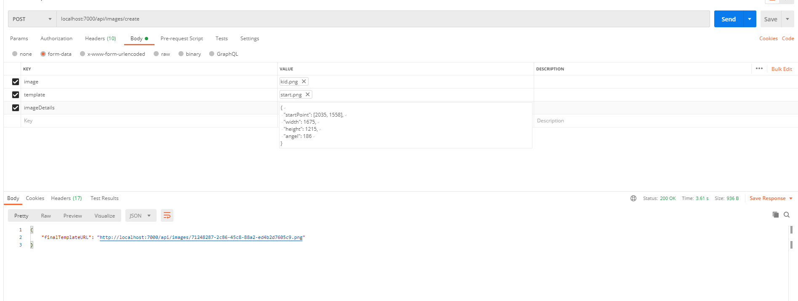

```
Hey There! 🙌 
```

A Simple Node.js API that composite two images.

* This API is built using [Express.js] web framework.. 
* For storing custom constant configurations within the `process.env` - [DotEnv](https://github.com/motdotla/dotenv) package is used.
* For Routing - Repo contains the use of [express-router](https://expressjs.com/en/guide/routing.html) & have distributed Routes into two files ie. Web Routes & API Routes. 


# Global Requisites

* node (>= 10.16.0)


# Install, Configure & Run

```bash
# Clone the repo.
git clone https://github.com/abdelrhmanayman/compositing-two-images.git

# Goto the cloned project folder.
cd compositing-two-images;


npm install;

# Edit your DotEnv file using any editor of your choice.
# Please Note: You should add all the configurations details
vim .env;

# Run the app
npm run dev;
```

# List of Routes

```sh
# Web Routes:

+--------+-------------------------+
  Method | URI
+--------+-------------------------+
  GET    | /api/images/:imagePath
  POST   | /api/images/create
+--------+-------------------------+

```
# Testing From Postman


